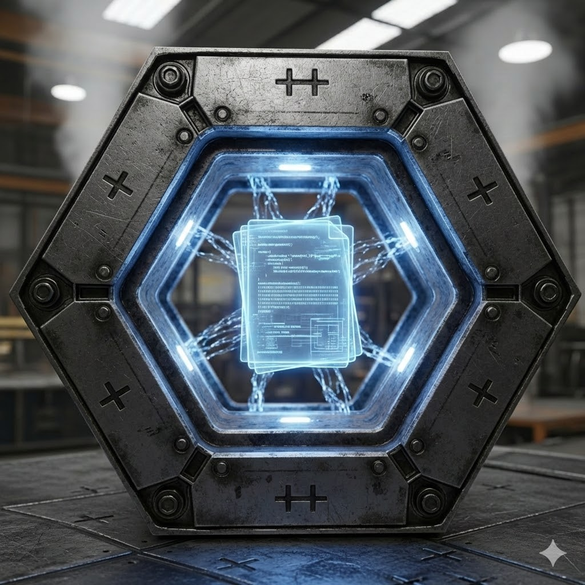

# lite3-cpp (formerly lite3++)

A C++ port of the [lite3.io](https://lite3.io/) zero copy serialization library.
A C++ port of the [lite3.io](https://lite3.io/) zero copy serialization library.

## Features
*   **Modern C++ API**: Intuitive `Document`, `Value`, `Object`, `Array` proxies (`doc["key"] = 42`).
*   **Zero-Copy**: Operates directly on mutation-friendly B-Tree buffers.
*   **Zero-Parse**: Read/Modify/Write without deserializing the entire document.

## Configuration & Performance

High-performance applications can disable the observability subsystem at compile time to eliminate all overhead (zero-cost).

### CMake Options

| Option | Default | Description |
| :--- | :--- | :--- |
| `LITE3CPP_DISABLE_OBSERVABILITY` | `ON` | If `ON`, all logging/metrics calls are no-ops. Set to `OFF` to enable. |

**To enable observability:**
```bash
cmake -DLITE3CPP_DISABLE_OBSERVABILITY=OFF ..
```

## Observability Interface

The `lite3-cpp` library provides an extensible observability interface through `ILogger` and `IMetrics` to allow users to integrate their custom logging and metrics collection systems.

### `ILogger`

The `ILogger` interface allows you to plug in a custom logging backend. You can implement this interface and set your logger instance to receive detailed log messages from the library.

**Example Implementation (ConsoleLogger):**
```cpp
#include "observability.hpp"
#include <iostream>
#include <string_view>

class ConsoleLogger : public lite3cpp::ILogger {
public:
    bool log(lite3cpp::LogLevel level,
           std::string_view message,
           std::string_view operation,
           std::chrono::microseconds duration,
           size_t buffer_offset,
           std::string_view key) override {
        std::cout << "[LogLevel::" << static_cast<int>(level) << "] "
                  << message << " | "
                  << "operation: " << operation << " | "
                  << "duration: " << duration.count() << "us | "
                  << "offset: " << buffer_offset << " | "
                  << "key: " << key
                  << std::endl;
        return true;
    }
};
```

### `IMetrics`

The `IMetrics` interface provides hooks for collecting various performance and usage metrics from the library.

**Example Implementation (ConsoleMetrics):**
```cpp
#include "observability.hpp"
#include <iostream>
#include <string_view>

class ConsoleMetrics : public lite3cpp::IMetrics {
public:
    bool record_latency(std::string_view operation, double seconds) override { return true; }
    bool increment_operation_count(std::string_view operation, std::string_view status) override { return true; }
    bool set_buffer_usage(size_t used_bytes) override { return true; }
    bool set_buffer_capacity(size_t capacity_bytes) override { return true; }
    bool increment_node_splits() override { return true; }
    bool increment_hash_collisions() override { return true; }
};
```

### Metric Naming Conventions

To ensure consistency and facilitate easier analysis in external monitoring systems, it is recommended to follow a consistent naming convention for `operation` strings used in `IMetrics` methods (e.g., `record_latency`, `increment_operation_count`).

A suggested convention is `ComponentName.OperationName` or `ComponentName.Subsystem.OperationName`.

**Examples:**
*   `lite3-cpp.Buffer.SetString`
*   `lite3-cpp.Node.NodeWrite`
*   `lite3-cpp.Json.JsonParse`
*   `lite3-cpp.Iterator.IteratorNext`

### Setting Custom Implementations

You can set your custom `ILogger` and `IMetrics` implementations using the `lite3cpp::set_logger` and `lite3cpp::set_metrics` functions:

```cpp
#include "observability.hpp"
// Include your custom Logger and Metrics headers here

int main() {
    MyCustomLogger logger;
    MyCustomMetrics metrics;

    lite3cpp::set_logger(&logger);
    lite3cpp::set_metrics(&metrics);

    // ... Your lite3cpp library usage here ...

    // To reset to default null implementations (no-op), you can pass nullptr
    lite3cpp::set_logger(nullptr);
    lite3cpp::set_metrics(nullptr);

    return 0;
}
```

### Ownership Semantics

It is crucial to understand that the `lite3-cpp` library does **NOT** take ownership of the `ILogger` and `IMetrics` objects passed to `lite3cpp::set_logger` and `lite3cpp::set_metrics`. The caller is entirely responsible for managing the lifetime of these objects. Ensure that the logger and metrics instances remain valid and alive for as long as they are set and used by the `lite3-cpp` library to avoid use-after-free bugs.

### Thread Safety

The `lite3cpp::set_logger` and `lite3cpp::set_metrics` functions are thread-safe, allowing for concurrent updates to the global logger and metrics instances.

### Log Level Filtering

The `lite3-cpp` library allows you to control the verbosity of log messages through a global log level threshold. Messages with a `lite3cpp::LogLevel` lower than the set threshold will be filtered out and not passed to the `ILogger` implementation.

You can set the global log level threshold using `lite3cpp::set_log_level_threshold`:

```cpp
#include "observability.hpp"

int main() {
    // Set a logger and metrics collector first (as shown above)
    // ConsoleLogger logger;
    // lite3cpp::set_logger(&logger);

    // Set the log level threshold to Warning.
    // Only messages with lite3cpp::LogLevel::Warn or lite3cpp::LogLevel::Error will be processed.
    lite3cpp::set_log_level_threshold(lite3cpp::LogLevel::Warn);

    // ... library operations that generate logs ...

    // Reset to default (lite3cpp::LogLevel::Info)
    lite3cpp::set_log_level_threshold(lite3cpp::LogLevel::Info);

    return 0;
}
```

The internal logging calls within the `lite3-cpp` library use a helper function, `lite3cpp::log_if_enabled`, which automatically checks the global log level threshold before dispatching to your custom `ILogger` implementation. You can also use this helper function in your own code to ensure consistency with the `lite3-cpp` library's filtering logic.

### Error Handling in Implementations

The `log` method in `ILogger` and all methods in `IMetrics` now return a `bool` value. This return value indicates whether the observability operation (e.g., logging a message, recording a metric) was successfully *processed by the underlying implementation*.

*   **`true`**: The operation was successfully processed by the implementation.
*   **`false`**: The operation failed within the implementation (e.g., failed to write to a log file, failed to send metrics over a network).

The `lite3-cpp` library's core logic will generally *ignore* the return value from these methods to ensure that observability failures do not disrupt the primary application flow. However, implementers of `ILogger` and `IMetrics` can use this return value internally to handle their own errors (e.g., retries, fallback mechanisms, internal error logging).
